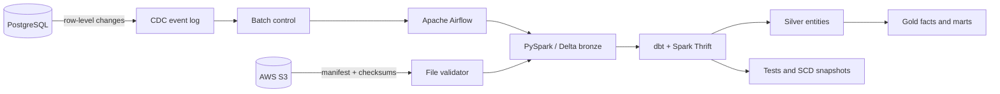

# Retail Lakehouse Pipeline

A local-first retail data platform that ingests transactional change events from PostgreSQL, stores them as Delta Lake tables, and produces tested analytics models with dbt. Apache Airflow coordinates the pipeline; AWS S3 remains the external file-delivery boundary for versioned source bundles.

The repository includes a retail CSV dataset so the complete CDC path can be run and inspected locally. It is a technical portfolio project and is not affiliated with Walmart.

## System design



## Engineering decisions

**Treat source changes as data.** PostgreSQL triggers append insert, update, and delete events to a durable change log. A separate control table claims batches, records state transitions, and keeps failures retryable instead of coupling extraction to a one-off script run.

**Keep raw history separate from analytics contracts.** Bronze Delta tables retain batch IDs, source transaction metadata, operation type, and event time. dbt turns those records into typed silver entities and curated gold models. This separates replayable ingestion from business-facing reporting.

**Protect metric grain.** `fact_order_items` is the detailed sales fact, while `fact_orders` is order-grain. The intermediate order-item model explicitly avoids historical employee-join fan-out, and tests reconcile order totals to line totals.

**Publish only validated batches.** The Airflow DAG runs preflight checks, claims CDC work, writes bronze Delta, executes `dbt build`, and marks the batch `PUBLISHED` only after models, snapshots, and tests pass.

**Use S3 as a controlled delivery interface.** The S3 utility uploads complete file bundles with SHA-256 checksums and writes the manifest last. Validation rejects incomplete or altered deliveries before ingestion.

**Keep the local stack reproducible.** Docker Compose runs the source database, Airflow metadata database, Spark Thrift Server, and Airflow services. Delta tables live in named volumes so application containers can be rebuilt without losing lakehouse data.

## Verified execution

The pipeline was run locally from a fresh Docker stack.

| Checkpoint | Result |
| --- | --- |
| Source load | 2,000 customers, 25 stores, 500 products, 250 employees, 10,000 orders, and 30,021 order items |
| CDC | 42,796 durable events captured |
| Bronze | Six Delta tables written from a replay-safe batch |
| dbt | 10 table models, 1 view, 4 SCD snapshots, and 23 data tests passed (**38/38**) |
| Orchestration | Airflow DAG `retail_lakehouse` completed successfully |

## Run it locally

**Requirements:** Docker Desktop running, PowerShell, and sufficient Docker memory for Airflow and Spark. AWS credentials are only required for S3 commands.

```powershell
# Create local configuration and generate service secrets
powershell -ExecutionPolicy Bypass -File .\scripts\project.ps1 init

# Check Docker configuration and start the stack
powershell -ExecutionPolicy Bypass -File .\scripts\project.ps1 doctor
powershell -ExecutionPolicy Bypass -File .\scripts\project.ps1 up

# Load the included source data and trigger the pipeline
powershell -ExecutionPolicy Bypass -File .\scripts\project.ps1 load
powershell -ExecutionPolicy Bypass -File .\scripts\project.ps1 run
```

Airflow is available at [http://localhost:8080](http://localhost:8080); the generated login values are in `.env`. Spark UI is exposed at [http://localhost:4040](http://localhost:4040).

```powershell
# Service state and recent logs
powershell -ExecutionPolicy Bypass -File .\scripts\project.ps1 status
powershell -ExecutionPolicy Bypass -File .\scripts\project.ps1 logs
```

## AWS S3 configuration

The AWS path is optional for local CDC execution. To use file-bundle delivery, populate the following values in the root `.env` file. Do not commit this file.

```dotenv
AWS_ACCESS_KEY_ID=...
AWS_SECRET_ACCESS_KEY=...
AWS_DEFAULT_REGION=...
S3_BUCKET=your-bucket-name
S3_PREFIX=retail-lakehouse/dev/
```

The IAM identity needs `s3:ListBucket`, `s3:GetObject`, and `s3:PutObject` for the selected bucket and prefix. Verify access and upload a versioned dataset bundle:

```powershell
powershell -ExecutionPolicy Bypass -File .\scripts\project.ps1 s3-check
powershell -ExecutionPolicy Bypass -File .\scripts\project.ps1 s3-upload -Sequence 1
```

## Data model

| Layer | Models | Responsibility |
| --- | --- | --- |
| Bronze | Six Delta tables matching source entities | Event history, batch lineage, and replayability |
| Silver | customers, stores, products, employees, orders, order items | Typed, deduplicated business entities |
| Intermediate | `order_items_enriched` | Preserves one row per order item |
| Gold | `fact_orders`, `fact_order_items`, `mart_daily_sales`, `mart_store_workforce` | Analytics-ready facts and marts |
| Snapshots | customers, stores, products, employees | Slowly changing dimension history |

## Repository layout

```text
├── dags/                         Airflow orchestration
├── pipelines/                    CDC, Delta bronze, and S3 delivery utilities
├── infra/postgres/               Source schema, triggers, and control tables
├── infra/airflow/                Airflow image and dbt runtime
├── infra/spark/                  Spark and Delta image
├── airflow_dbt_project/
│   └── walmart_project/          dbt models, snapshots, and tests
├── walmart_dataset/              Included CSV data and source loader
├── scripts/                      PowerShell commands for operating the stack
├── compose.yaml                  Local service topology
└── .env.example                  Required configuration keys
```

## Credentials and data

`.env` is excluded from Git and holds local passwords and AWS credentials. The included retail data is provided for reproducibility. This project demonstrates data-engineering patterns and does not represent production systems or operational data from Walmart.
