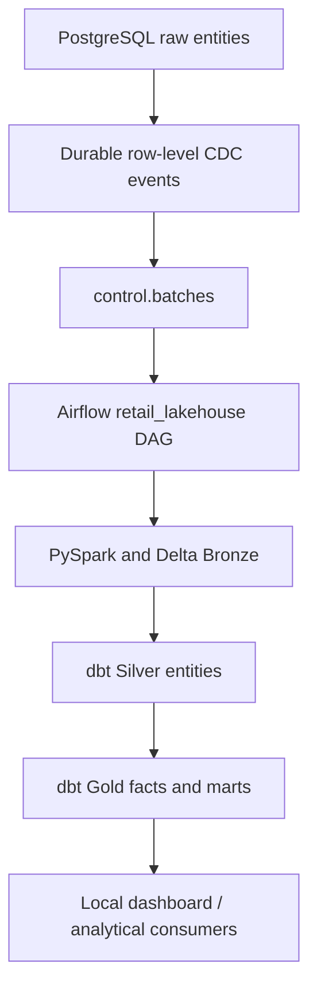

# PostgreSQL Query Plan Lab & OLTP-to-OLAP Walkthrough

## Why This Lab Exists

This lab records real PostgreSQL plans from the local retail dataset and traces how this project's operational source becomes Delta and dbt analytics models. It is a small exercise in reading plans and reasoning about access paths, not a performance benchmark.

## Environment

- Captured: **2026-10-01**
- Runtime: the repository's Docker Compose source PostgreSQL container
- PostgreSQL: **16.4** (`postgres:16.4-bookworm` image)
- Current source row counts: customers 2,000; stores 25; products 500; employees 250; orders 10,000; order_items 30,021
- CDC table: 42,796 events; one published batch; zero events awaiting acknowledgement

The values above were queried from the local database. Before capturing plans, `ANALYZE raw.orders` and `ANALYZE raw.order_items` refreshed planner statistics. These results describe this machine, this data, and this PostgreSQL build.

To inspect the database from the repository root:

```powershell
docker compose exec -T source-postgres psql -U retail -d retail -P pager=off -c "SELECT version();"
docker compose exec -T source-postgres psql -U retail -d retail -P pager=off -c "SELECT 'orders' AS table_name, count(*) FROM raw.orders UNION ALL SELECT 'order_items', count(*) FROM raw.order_items;"
```

## How to Read `EXPLAIN ANALYZE`

`EXPLAIN` shows the plan PostgreSQL chose. `ANALYZE` executes the query and adds observed row counts and timings.

- `cost=start..total` is the planner's estimated work in arbitrary cost units, not milliseconds. The first number is the estimated startup cost; the second is the total cost.
- `rows` is the estimated output row count for a plan node. In the `actual` section, `rows` is what that node returned in this execution.
- `actual time=a..b` is time in milliseconds to first row and to finish that node. Node times include work below the node, so do not sum them across the tree.
- `loops` is how many times a node ran. Compare actual rows with loops in repeated nodes.
- `Seq Scan` reads a table and applies its filter. `Index Scan` follows an index to find candidate rows and then fetches the table rows. Either can be the right choice.
- `Buffers: shared hit` counts blocks already in PostgreSQL shared buffers; `shared read` counts blocks PostgreSQL had to read into them. A shared read does not necessarily mean a physical disk read because the operating system may cache it.

## Example 1 — A Sequential Scan for a Broad Status Filter

Query:

```sql
EXPLAIN (ANALYZE, BUFFERS)
SELECT count(*)
FROM raw.orders
WHERE order_status = 'Completed';
```

Captured plan:

```text
Aggregate  (cost=275.12..275.13 rows=1 width=8) (actual time=1.059..1.060 rows=1 loops=1)
  Buffers: shared hit=144
  ->  Seq Scan on orders  (cost=0.00..269.00 rows=2447 width=0) (actual time=0.006..0.924 rows=2447 loops=1)
        Filter: ((order_status)::text = 'Completed'::text)
        Rows Removed by Filter: 7553
        Buffers: shared hit=144
Planning:
  Buffers: shared hit=12
Planning Time: 0.118 ms
Execution Time: 1.079 ms
```

The table has 10,000 rows and 2,447 have `Completed` status (about 24.5%). The plan estimated 2,447 rows and returned exactly 2,447. The source schema has a primary-key index on `order_id`, but no index on `order_status`. Even if a status index existed, this query asks for a sizeable fraction of this small table and only counts matches. Reading the table's 144 cached blocks in one sequential pass is a reasonable choice. `Seq Scan` says how the rows were found; by itself it does not say the query is faulty or slow.

The execution time is one local observation with cached blocks. It is not evidence of a general latency target.

## Example 2 — Selective Order-Item Lookup Before and After a Lab Index

`raw.order_items.order_id` is a foreign key to `raw.orders.order_id`. The migration gives `order_item_id` a primary-key index, but does not create an index on this referencing column. In the loaded data, order 1 has five line items out of 30,021 rows (about 0.017%).

Query, before adding an index:

```sql
EXPLAIN (ANALYZE, BUFFERS)
SELECT order_item_id, order_id, product_id, quantity, line_amount
FROM raw.order_items
WHERE order_id = 1;
```

Captured plan before the experiment:

```text
Seq Scan on order_items  (cost=0.00..746.26 rows=5 width=34) (actual time=0.010..1.579 rows=5 loops=1)
  Filter: (order_id = 1)
  Rows Removed by Filter: 30016
  Buffers: shared hit=371
Planning:
  Buffers: shared hit=82
Planning Time: 0.273 ms
Execution Time: 1.624 ms
```

PostgreSQL estimated five rows and found five, but the sequential scan inspected all 30,021 rows. For this selective lookup, an index on the foreign key is a sensible experiment. The index below is created inside a transaction and dropped before commit; if the session is interrupted before the drop, PostgreSQL rolls the transaction back when the connection closes.

Run this from PowerShell at the repository root to reproduce the index plan safely:

```powershell
@'
BEGIN;
CREATE INDEX query_plan_lab_order_items_order_id_idx ON raw.order_items (order_id);
ANALYZE raw.order_items;
EXPLAIN (ANALYZE, BUFFERS)
SELECT order_item_id, order_id, product_id, quantity, line_amount
FROM raw.order_items
WHERE order_id = 1;
DROP INDEX raw.query_plan_lab_order_items_order_id_idx;
ANALYZE raw.order_items;
COMMIT;
'@ | docker compose exec -T source-postgres psql -v ON_ERROR_STOP=1 -U retail -d retail -P pager=off
```

Captured plan with the temporary index:

```text
Index Scan using query_plan_lab_order_items_order_id_idx on order_items  (cost=0.29..8.38 rows=5 width=34) (actual time=0.047..0.049 rows=5 loops=1)
  Index Cond: (order_id = 1)
  Buffers: shared hit=4 read=2
Planning:
  Buffers: shared hit=95 read=1
Planning Time: 0.355 ms
Execution Time: 0.095 ms
```

For this key lookup, the planner switched from `Seq Scan` to `Index Scan`; the estimated and actual result count stayed at five. The index plan touched far fewer PostgreSQL shared buffers. The observed execution time was lower in this run, but these single runs are sensitive to cache state and machine load and should not be treated as a measured speedup. The lab index was dropped, and a follow-up catalog query returned no matching index. The canonical migration and application schema were not changed.

Indexes need storage and must be maintained during writes. They help when a query can use them to avoid reading much of a table; they can add work to inserts, updates, and deletes. The best choice depends on query selectivity, table size, and the data pages that must be fetched.

## Example 3 — Join and Aggregate Across Orders and Line Items

This query resembles reporting work: combine order context with line-level amounts, aggregate to store, then sort stores by gross line amount.

```sql
EXPLAIN (ANALYZE, BUFFERS)
SELECT o.store_id,
       count(DISTINCT o.order_id) AS order_count,
       count(*) AS order_item_count,
       sum(oi.line_amount) AS gross_line_amount
FROM raw.orders o
JOIN raw.order_items oi ON oi.order_id = o.order_id
GROUP BY o.store_id
ORDER BY gross_line_amount DESC;
```

Captured plan:

```text
Sort  (cost=3727.82..3727.88 rows=25 width=56) (actual time=35.116..35.122 rows=25 loops=1)
  Sort Key: (sum(oi.line_amount)) DESC
  Sort Method: quicksort  Memory: 26kB
  Buffers: shared hit=521
  ->  GroupAggregate  (cost=3351.66..3727.24 rows=25 width=56) (actual time=28.895..35.054 rows=25 loops=1)
        Group Key: o.store_id
        Buffers: shared hit=518
        ->  Sort  (cost=3351.66..3426.72 rows=30021 width=22) (actual time=28.641..30.586 rows=30021 loops=1)
              Sort Key: o.store_id, o.order_id
              Sort Method: quicksort  Memory: 2176kB
              Buffers: shared hit=518
              ->  Hash Join  (cost=369.00..1119.05 rows=30021 width=22) (actual time=2.758..13.041 rows=30021 loops=1)
                    Hash Cond: (oi.order_id = o.order_id)
                    Buffers: shared hit=515
                    ->  Seq Scan on order_items oi  (cost=0.00..671.21 rows=30021 width=14) (actual time=0.013..2.388 rows=30021 loops=1)
                          Buffers: shared hit=371
                    ->  Hash  (cost=244.00..244.00 rows=10000 width=16) (actual time=2.658..2.659 rows=10000 loops=1)
                          Buckets: 16384  Batches: 1  Memory Usage: 597kB
                          Buffers: shared hit=144
                          ->  Seq Scan on orders o  (cost=0.00..244.00 rows=10000 width=16) (actual time=0.007..1.162 rows=10000 loops=1)
                                Buffers: shared hit=144
Planning:
  Buffers: shared hit=139 read=6
Planning Time: 5.581 ms
Execution Time: 35.499 ms
```

Both tables are read in full because there is no filter and the aggregate uses all orders and line items. PostgreSQL builds a hash table from the 10,000 orders, joins the 30,021 line items, sorts rows by store and order, and uses `GroupAggregate` to produce 25 stores. Here the sequential scans are expected inputs to a full-table analytical query. This plan is a local example of join and aggregation nodes, not a claim that PostgreSQL is the project's analytics warehouse.

## OLTP → OLAP in Retail Lakehouse



### PostgreSQL source: OLTP-style layer

The six `raw` tables are entity-oriented: customers, stores, products, employees, orders, and order items. Each has a primary key; orders and order items also have foreign-key relationships. The CSV loader uses `COPY` to populate these tables, and row-level inserts, updates, and deletes are captured by triggers. This is an OLTP-style schema with transaction-friendly keys and operational records. It is a local portfolio source, not a database serving a real retail production workload.

### CDC: the ingestion boundary

`control.capture_change()` appends an event with a `bigserial` `event_id`, `source_epoch`, PostgreSQL transaction ID, table name, business key, operation (`I`, `U`, or `D`), before/after JSON images, and `occurred_at`. Events are not removed when processed: `acknowledged_at` records that the batch has been applied and validated. The partial index on `(source_epoch, event_id)` where `acknowledged_at IS NULL` supports pending-event reads.

`claim_cdc_batch()` takes a transaction-scoped advisory lock, reuses an unpublished batch if one exists, or stores the current pending event IDs in a new UUID batch. A failed batch can be claimed again with its attempt count increased. This gives extraction a durable boundary from the later Spark/dbt work.

### Bronze: replayable analytical history

Airflow invokes `pipelines.bronze`. The landing JSONL includes the event ID, source epoch, operation, event time, and row images; a manifest records the batch and event count. The event ledger is appended to Delta with a stable application ID and event-based transaction version.

For each source entity, PySpark selects the event payload, marks deletes as `is_deleted`, and uses the Spark `Window` API with `row_number()` partitioned by the entity primary key and ordered by descending `event_id`. This chooses the latest event for each key within the batch. Delta `MERGE` matches on that key and only updates a row when the incoming event ID is newer; a delete remains as a tombstone for downstream filtering. The code records validation counts and acknowledges CDC events after bronze application and validation.

### Silver: typed business entities

The dbt silver models read the Delta bronze paths, filter out `is_deleted` rows, and cast fields to analytics types. For example, `models/silver/orders.sql` casts `order_timestamp` and `total_amount`; `models/silver/order_items.sql` casts quantity and monetary fields. These models turn event-backed bronze state into entity tables suitable for downstream joins.

### Gold: OLAP and business grain

`fact_orders` has one row per order, while `fact_order_items` has one row per order item. `order_items_enriched` joins items to orders, products, and stores while retaining the order-item grain. `mart_daily_sales` groups by date, store, product category, and order status, then calculates order counts, item counts, and gross/completed line amounts. `mart_store_workforce` groups employee count and salary by store.

Gold models support scans, joins, and aggregations for analysis. In this repository, the local dashboard can query Spark SQL models; the verified pipeline DAG is CDC-driven. S3 upload and manifest validation utilities are present, but the current DAG rejects `INPUT_MODE=files` until a file snapshot converter is selected.

### Why separate the layers?

The operational tables hold the current entity records and accept row-level changes. The CDC log and bronze tables preserve how those records changed and let ingestion be retried. Silver gives downstream models typed entities; gold applies analytical grain and aggregation. Keeping those responsibilities separate makes it possible to validate a batch before marking it published and avoids running reporting joins directly as part of each source write. Analytical scans are also a different access pattern from key-based operational reads.

## SQL Patterns Already Used in This Project

The models contain executable joins and aggregations, not just configuration:

- [`order_items_enriched`](../airflow_dbt_project/retail_lakehouse/models/intermediate/order_items_enriched.sql) joins line items to orders, products, and stores.
- [`mart_daily_sales`](../airflow_dbt_project/retail_lakehouse/models/gold/mart_daily_sales.sql) uses `COUNT(DISTINCT ...)`, `COUNT(*)`, `SUM(...)`, and `GROUP BY` to define date/store/category/status grain.
- [`order_item_grain.sql`](../airflow_dbt_project/retail_lakehouse/tests/order_item_grain.sql) uses `GROUP BY` and `HAVING count(*) <> 1` to return duplicate keys as test failures.
- [`reconcile_order_amounts.sql`](../airflow_dbt_project/retail_lakehouse/tests/reconcile_order_amounts.sql) compares summed order and line amounts and returns a failing row when they differ.
- dbt schema tests check key uniqueness and nullability, plus relationships from orders to customers/stores and order items to orders/products.

These SQL models run through dbt on Spark/Delta. The query plans above were captured against PostgreSQL source tables; they are separate engines and their plans should not be conflated.

## Idempotency and Replay Safety

Each CDC event has a durable `event_id`, and each batch stores its UUID, source epoch, and event ID array. On retry, the Delta event append uses the same application ID and transaction version derived from the batch's maximum event ID. The current-state table uses a merge on each entity's primary key and accepts only a higher event ID. Repeating a batch therefore does not blindly append another current row for a business key; a delete is retained as an `is_deleted` tombstone.

This is replay-safe behavior in the current local pipeline, not a claim of exactly-once distributed processing. The source loader also refuses to load a different CSV snapshot over a populated raw schema, so multi-epoch replacement is outside this implementation's behavior.

## What I Learned

- A sequential scan is a description of an access path; selectivity and the amount of data returned determine whether it is a concern.
- Estimates matter: in these plans, estimated and actual rows matched after refreshing statistics.
- A primary key does not imply that every foreign-key lookup has an index. I checked the catalog before testing `order_items.order_id`.
- The temporary index changed the plan for a five-row lookup, while a full reporting join still reasonably scanned both tables.
- A plan's timing is one observation affected by cache and machine conditions. It cannot establish production performance.
- Business grain belongs in the data model and tests: order counts and line-item amounts need different fact grains.
- CDC identities and batch state make failures inspectable and retries useful, while still requiring precise claims about delivery guarantees.

## Limitations

- This is a small, local reproducible dataset; it does not represent production-scale tuning.
- Plans can change with PostgreSQL version, statistics, table size, cache state, configuration, and hardware.
- A `Seq Scan` is not inherently bad. In these examples it is reasonable for a broad filter and a full-table join.
- The index comparison is a single before/after observation, not a controlled benchmark.
- The lab index was temporary and removed; canonical source DDL was left unchanged.
- The captured PostgreSQL plans do not describe Spark's query planner or Delta execution.
